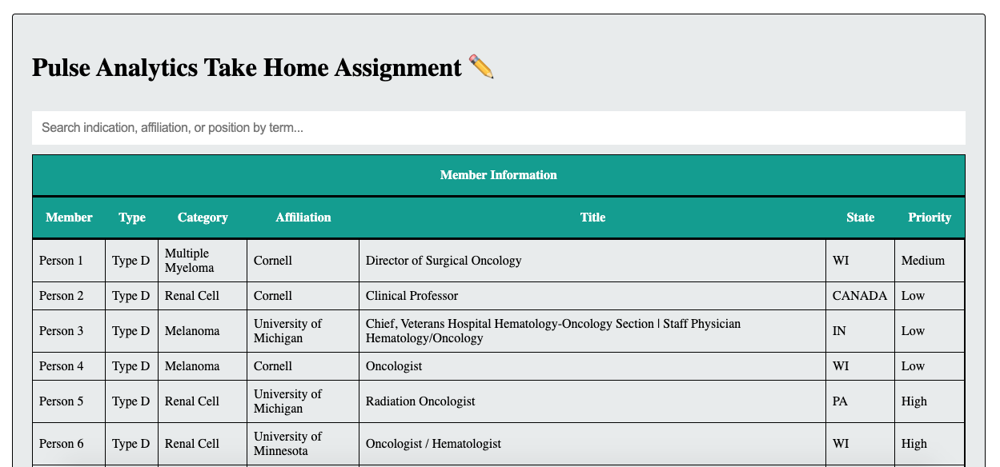
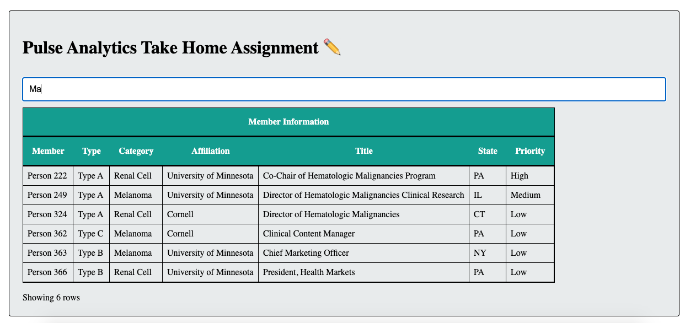
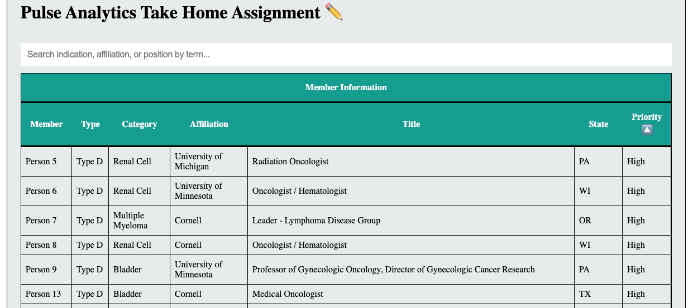

# 💊 `Search Pulse` 💊

- [Link to the Deployed App](https://pulse-analytics-coding-challenge.netlify.app/)

---

## `💊 Preferred browser - Google Chrome 💊`

  <br/>
Search Pulse is an assigned Frontend Coding challenge. This take home assignment has three distinct exercises that represent real-world problems.

---

## `💊 Prompt 💊`

Given a dataset and a frontend framework, complete the three tasks while following the following constraints :

- Use only JavaScript for this assignment.
- Do not install additional packages.
- Refrain from touching the directory structure a challenge.

---

## `💊 How to run this project on your local server to this Project? 💊`

```shell
git clone https://github.com/mcherry000/pulse2021.git
npm install
npm start
```

After starting the development server with `npm start`, you can edit any files in the `src` folder
and webpack will automatically recompile and reload your server (available at `http://localhost:3000` by default).

---

## `💊 Tech Stack: 💊`

[][html]

[][css]

[][js]

[][netlify]

[][github]

[][npm]

[][node]

[html]: http://www.w3.org/html/logo/
[css]: http://www.w3.org/html/logo/
[npm]: https://github.com/npm/logos
[node]: https://nodejs.org/en/about/resources/
[netlify]: https://www.netlify.com/press/
[js]: https://github.com/voodootikigod/logo.js
[html]: http://www.w3.org/html/logo/
[github]: https://github.com/logos

## <br/>

---

## `💊 Exercises 💊`

- Each exercise has corresponding comments to explain the "why" and "how" of Algorithms.

### 01. `uniqueBy`

Ensures the uniqueness of an array of data objects for a given key.

### 02. `filterBy`

Filters an array of data objects by a given search term.

### 03. `Influencers Display`

Renders the influencers data. The page now consist of three parts -- a search bar, corresponding sort buttons for each column in table, and a display for influencers data.

---

## `💊 On home screen you'll find a search bar and tabularised data underneath ...`



---

## `💊 You can search by word (or an incomplete word). The App will display the closest match(es) pre-sorted in a High-to-Low priority algorithm...`



---

## `💊 You can also manually sort the columns of the table using toggle-button(s)...`



---

## `💊 What's missing? 💊`

A sort-by-priority button. The funtion "sortBy" is yet to be wired to the frontEnd via hooks. The Algorithm underneath has been tested for accuracy and is functional at the time of submission.

---

## Submission

- [💊 To Use the app, click here 💊 ](https://pulse-analytics-coding-challenge.netlify.app/)
  <br/>

---

## `👩‍ Developer Info`

| Engineer        | LinkedIn Profile                                | GitHub Profile                |
| --------------- | ----------------------------------------------- | ----------------------------- |
| ☀️ Manika Arora | https://www.linkedin.com/in/manika-a-11692716b/ | https://github.com/mcherry000 |

---
